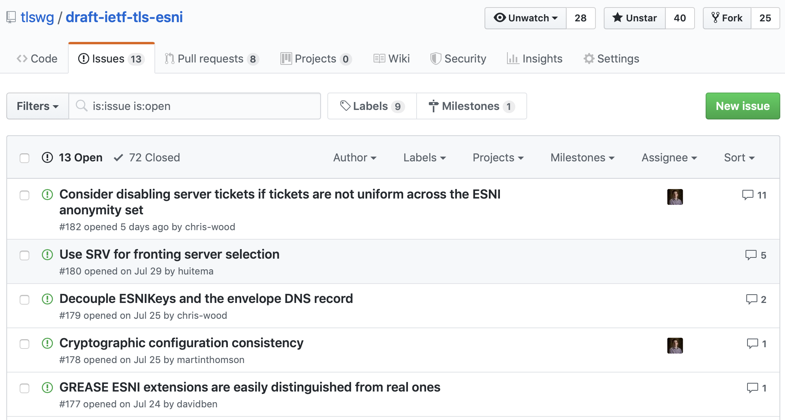
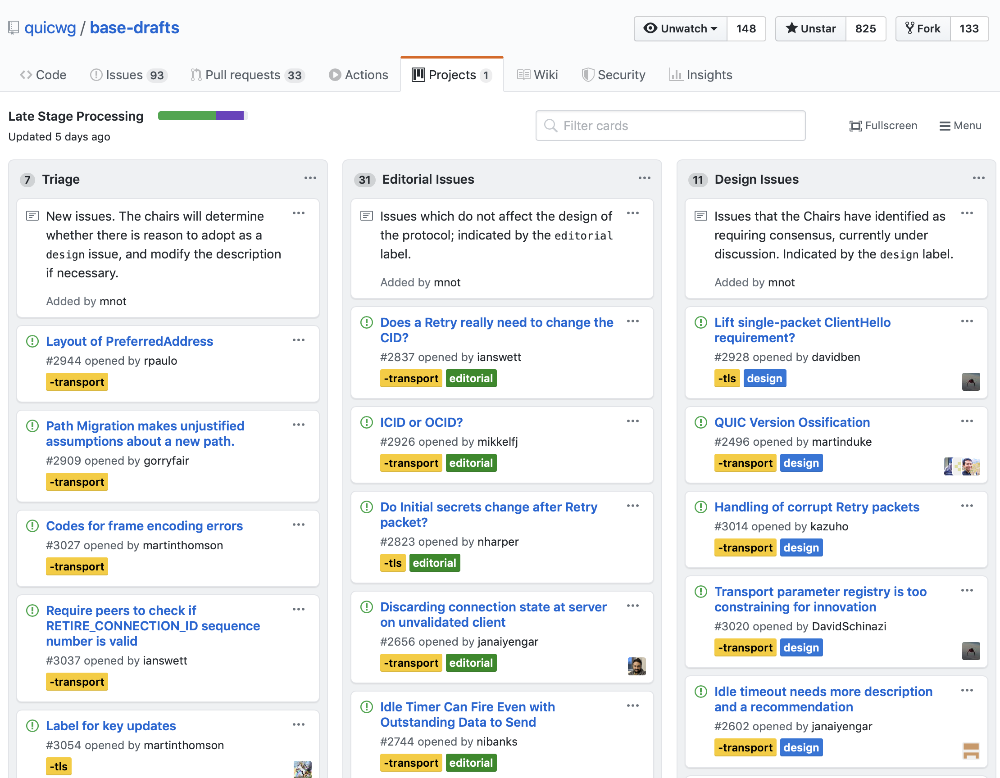

# Introduction

GitHub and similar version control systems used for developing IETF Internet Drafts and managing Working Group process in a transparent fashion can be highly effective. GitHub in particular enables several different modes of interaction for Working Groups and its participants, as discussed in the [Using GitHub draft](https://ietf-gitwg.github.io/using-github/draft-ietf-git-using-github.html). However, using these systems without any prior experience may be challenging. 

This document serves as a tutorial for GitHub and its underlying concepts. It provides instructions for interacting with GitHub for the purposes of managing, developing, and advancing Internet Drafts.

# Technology Overview

This section presents an overview of technologies related to the use of GitHub for IETF draft development and working group activities. It assumes familiarity with the general concept of version control systems. Readers familiar with this information may skip ahead without loss of continuity.

## Git

[Git](https://git-scm.com/book/en/v2) is a distributed version control system (VCS). As such, it provides a persistent, ordered history of modifications to files under source control. For the purposes of this work, that means text documents for Internet Drafts. This can be, for example, [Markdown](https://www.ietf.org/about/participate/tutorials/process/writing-rfcs-and-internet-drafts-markdown-and-bit-yaml/) or [XML](https://tools.ietf.org/html/rfc2629). Markdown is the preferred medium for documents tracked and managed with Git. 

There are a few concepts that are useful to know when working with Git, described below.

### Repository

A Git repository is a collection of files under source control.

### Commit

A commit is effectively a snapshot of all tracked files at a particular point in time. Each snapshot of a file is stored by hash. Each commit is a collection of file snapshots that capture the current state of the repository. Each commit has at least one parents to track history, as shown below.

~~~
... ====[commit 1]====[commit 2]====...===[commit N]===[commit N+1]===>
~~~

### [Branch](https://help.github.com/en/articles/github-glossary#branch) {#branch}

Git uses the concept of "branches" to track repository snapshots. A branch points to an ordered sequence of commits. They are cheap to create and dispose. 

Minimally, each repository has a branch called "master," shown below. 

~~~
master: ====[commit 1]====[commit 2]====...===[commit N]===[commit N+1]===>
~~~

Many branches can exist in parallel. Ultimately, each of these branches "stem" from some commit in the "master" branch.

~~~
master: ====[commit 1]====[commit 2]====...===[commit N]===[commit N+1]===>
issue-1:                                            \====[commit 1]====[commit 2]====>
~~~

The base of a branch is the commit from which it originated. The tip of a branch is the latest commit in the sequence. In the example above, `commit 1` for the "issue-1" branch is *based* on `commit N` of the "master" branch.

Typically, individual features or document changes happen in branches through a series of one or more commits to said branches. 

### Merge

Upon completion of changes on a feature branch, the results are typically then added to a target branch. This procedure is referred to as *merging*, and is shown below.

~~~
master:  ...===[commit N]===[commit N+1]=========[commit N+2]===>
issue-1:            \====[commit 1]====[commit 2]====/
~~~

In this example, the "issue-1" branch is merged into master by creating a single commit -- `commit N+2` -- that combines `commit N+1` from "master" and `commit 2` from "issue-1". 

This type of merge is *not recommended*, as it makes the history of a particular repository difficult to read. Moreover, if the same parts of a version-controlled file were modified in the branches being merged, "conflicts" will occur. (Git cannot know whether changes from the source or target branch are correct.) In these cases, the authors needs to resolve the merge conflict, which is an error prone process.

### Re-Base and Merge

Authors can avoid merge conflicts by ensuring that their feature branches are always extensions of the target branch. Put differently, changing the base of a feature branch to be the tip of the target branch ensures that a merge to said target branch will (a) never conflict and (b) result in a *linear* history. This is shown below.

~~~
master:  ...===[commit N]===> (tip)             ====[commit N+1]===>
issue-1:              \====[commit 1]====[commit 2]====/
~~~

In this example, the "issue-1" branch was re-based on "master" from its tip (`commit N`). It then merges cleanly into "master" since all changes in "issue-1" are built on those in "master". (In other words, the sequence of commits is linear, with one path.)

### [Pull Request](https://help.github.com/en/articles/about-pull-requests)

Informally, a Pull Request (PR) is a process by which the developer or creator of a feature branch asks to merge changes to some target branch. 

## GitHub

GitHub is a platform that hosts Git repositories and provides a web interface for interacting with and managing repositories. Beyond basic Git functionality, GitHub provides the following features that are useful for Internet Draft document management:

- [Code review](https://github.com/features/code-review/): Prepare, review, and merge PRs.
- [Issue tracking](https://help.github.com/en/articles/about-issues): A single, per-repository mechanism for collecting draft feedback, reporting issues, and organize tasks.
- [Documentation](https://github.com/features#documentation): Wiki-style documentation pages that track miscellaneous information and content inappropriate for Internet Drafts yet still relevant to the work, such as pointers to software implementations, test vectors, or other testing tools.
- [Content hosting](https://github.blog/2016-08-22-publish-your-project-documentation-with-github-pages/): Web hosting for Internet Draft pages.

# Mode Workflows

The following workflows assume your development machine is setup accordingly. Please see [the instructions here](https://github.com/martinthomson/i-d-template/blob/master/doc/SETUP.md) for more details.

## Document Management Mode

This mode of interaction uses GitHub primarily as a Git provider. Thus, it describes how to create document repositories, modify them, and prepare and upload submissions.

### Document Repository Creation

Detailed steps for creating a repository using the [i-d-template](https://github.com/martinthomson/i-d-template) tool from Martin Thomson [can be found here](https://github.com/martinthomson/i-d-template/blob/master/doc/REPO.md).

### Document Modification

A [common workflow](https://guides.github.com/introduction/flow/) for editing documents is roughly as follows:

1. [Fork](https://help.github.com/en/articles/fork-a-repo) the repository, if not already done, and clone it to your development machine.

~~~
$ git clone git@github.com:ietf-gitwg/ietf-gitwg.github.io.git
~~~

2. Identify a branch in the forked repository for your work. This could be "master", or a new branch. Depending on your use case, it may be easiest to work from "master". However, for this example, we assume that changes work on change-specific branches. For example, if the specific change you intend to make is "add feature foo", the branch name might be "add-foo-feature". Or, if applying simple editorial changes, the branch might be named "edits". (Note that branch names must be unique within a repository, so "edits" is only useful insofar as it is deleted when finished.)

~~~
$ git checkout -b edits
~~~

3. Make changes on the document as needed for the change.

~~~
$ vim README.md
... fix typo ...
~~~

4. Add the changes locally, commit them to the branch, and push to the remote repository.

~~~
$ git add README.md
$ git commit -m "Fix typo in README.md"
$ git push -u origin edits
~~~

In the above sequence of commands, we first stage the changes to README.md for commit via `git add`. We then commit them with the corresponding message "Fix typo in README.md". If the commit message were not specified at the command line, `git commit` would open the default editor for this message to be specified. The message should describe what the change does. The last command pushes the commits on branch "edits" to the remote server "origin". The "-u" flag makes it so that subsequent pushes to the same branch, on the same remote repository, only require you to run `git push`. 

More details about the add, commit, push workflow [can be found here](https://guides.github.com/activities/hello-world/).

5. [Open a Pull Request](https://guides.github.com/activities/hello-world/#pr) for merging the changes into "master".

### Document Submission

When an updated version of the document needs to be uploaded to the datatracker, we need to compile a version for submission. Details for this using the i-d-template toolchain [are described here](https://github.com/martinthomson/i-d-template/blob/master/doc/SUBMITTING.md). For completeness, we summarize the manual approach here. 

Assume we're building a document entitled "draft-ietf-unicorn-protocol.md". We begin by making the version for submission:

~~~
$ make submit
~~~

This will produce "draft-ietf-unicorn-protocol-00.xml" (among other files). You may then submit this XML file [directly to the datatracker](https://datatracker.ietf.org/submit/). 

When complete, we "tag" this version, like so:

~~~
$ git tag -a draft-ietf-unicorn-protocol-00
$ git push origin draft-ietf-unicorn-protocol-00
~~~

This ensures that, the next time we run `make submit`, the version number increases from `00` to `01`. (The i-d-template tool uses git tags to determine what version to produce next.)

## Issue Tracking Mode

This mode of interaction assumes more familiarity with GitHub issues. There are plenty of helpful resources to get going, including, though not limited to:

- [About issues](https://help.github.com/en/articles/about-issues)
- [Creating an issue](https://help.github.com/en/articles/creating-an-issue)
- [Mastering issues](https://guides.github.com/features/issues/)

An example of issues used for tracking purposes for the [TLS Encrypted SNI](https://github.com/tlswg/draft-ietf-tls-esni) document is shown below.

## Issue Discussion Mode

This mode of interaction assumes familiarity with GitHub labels. Helpful resources to better understand and use them include:

- [About labels](https://help.github.com/en/articles/about-labels)
- [Creating a label](https://help.github.com/en/articles/creating-a-label)
- [Issues and Pull Requests](https://help.github.com/en/articles/applying-labels-to-issues-and-pull-requests)

Beyond using labels to help triage and discuss issues, this mode may also involve use of GitHub's [project boards](https://help.github.com/en/articles/about-project-boards). An example of the project board in use for the [QUIC](https://github.com/quicwg/base-drafts) repository is shown below.

# Additional Resources

- [Mike Bishop's IETF 104 Tutorial](https://datatracker.ietf.org/meeting/104/materials/slides-104-edu-sessg-git-github-and-markdown-for-internet-drafts-00)
